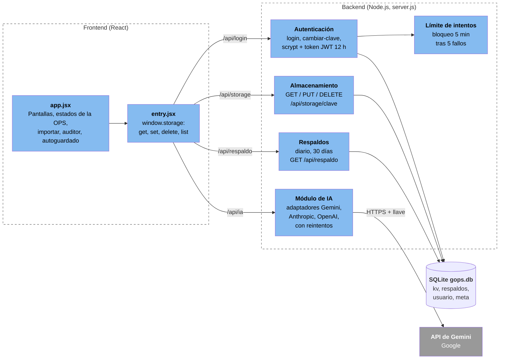
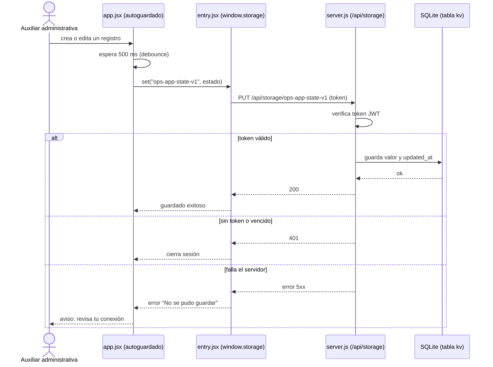

## Nivel 3: Componentes (backend y frontend)

```mermaid
flowchart LR
    subgraph FRONT["Frontend (React)"]
        APP["<b>app.jsx</b><br/>Pantallas, estados de la OPS,<br/>importar, auditor, autoguardado"]
        ENT["<b>entry.jsx</b><br/>window.storage:<br/>get, set, delete, list"]
    end
    subgraph BACK["Backend (Node.js, server.js)"]
        AUT["<b>Autenticación</b><br/>login, cambiar-clave,<br/>scrypt + token JWT 12 h"]
        LIM["<b>Límite de intentos</b><br/>bloqueo 5 min<br/>tras 5 fallos"]
        STO["<b>Almacenamiento</b><br/>GET / PUT / DELETE<br/>/api/storage/clave"]
        RES["<b>Respaldos</b><br/>diario, 30 días<br/>GET /api/respaldo"]
        IAC["<b>Módulo de IA</b><br/>adaptadores Gemini,<br/>Anthropic, OpenAI,<br/>con reintentos"]
    end
    DB[("<b>SQLite gops.db</b><br/>kv, respaldos,<br/>usuario, meta")]
    GEM["<b>API de Gemini</b><br/>Google"]
    APP --> ENT
    ENT -->|"/api/login"| AUT
    ENT -->|"/api/storage"| STO
    AUT --> LIM
    AUT --> DB
    STO --> DB
    RES --> DB
    ENT -->|"/api/respaldo"| RES
    ENT -->|"/api/ia"| IAC
    IAC -->|"HTTPS + llave"| GEM
    style FRONT fill:#fff,stroke:#555,stroke-dasharray:5 5
    style BACK fill:#fff,stroke:#555,stroke-dasharray:5 5
    style APP fill:#85bbf0,color:#000
    style ENT fill:#85bbf0,color:#000
    style AUT fill:#85bbf0,color:#000
    style LIM fill:#85bbf0,color:#000
    style STO fill:#85bbf0,color:#000
    style RES fill:#85bbf0,color:#000
    style IAC fill:#85bbf0,color:#000
    style GEM fill:#999,color:#fff
```

## Nivel 4: Código (flujo de guardado)

```mermaid
sequenceDiagram
    actor U as Auxiliar administrativa
    participant A as app.jsx (autoguardado)
    participant S as entry.jsx (window.storage)
    participant API as server.js (/api/storage)
    participant DB as SQLite (tabla kv)
    U->>A: crea o edita un registro
    A->>A: espera 500 ms (debounce)
    A->>S: set("ops-app-state-v1", estado)
    S->>API: PUT /api/storage/ops-app-state-v1 (token)
    API->>API: verifica token JWT
    alt token válido
        API->>DB: guarda valor y updated_at
        DB-->>API: ok
        API-->>S: 200
        S-->>A: guardado exitoso
    else sin token o vencido
        API-->>S: 401
        S-->>A: cierra sesión
    else falla el servidor
        API-->>S: error 5xx
        S-->>A: error "No se pudo guardar"
        A-->>U: aviso: revisa tu conexión
    end
```
